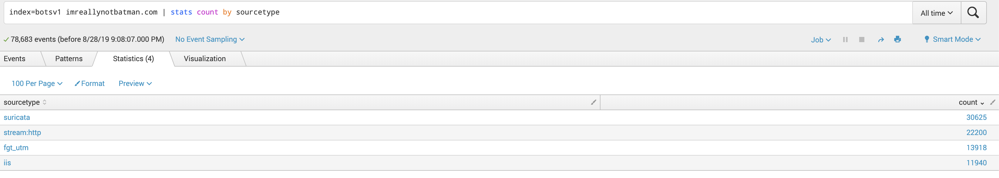
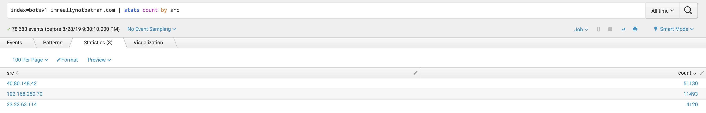
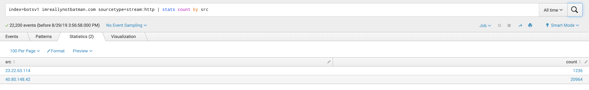

# Splunk: Scenario #1 - APT

## <u>Finding the IP Scanning Your Web Server</u>

### What is the likely IP address of someone from the P01s0n1vy group scanning imreallynotbatman.com for web application vulnerabilites?

1. Reconnaissance:

_Identify sourcetypes associated with search values_

* The different source types are:
  * **suricata** --> open source-based IDS and IPS developed by Open Information Security Foundation
    * https://suricata-ids.org/
  * **stream:http** --> web browsing traffic
  * **fgt_utm** --> Fortinet Unified Threat Management, product created by Fortinet that consolidates multiple security and network functions into one unified tool that protects businesses and simplifies infrastructure
    * https://www.fortinet.com/products/smallbusiness/utm.html
  * **iis** --> Internet Information Services, extensible web server created by Microsoft to use with Windows NT family
    * https://www.iis.net/
* suricata has the highest number of instances

_Finding Source Addresses_

* There are 3 different ip addresses shown:
  * 40.80.148.42
  * 192.168.250.70
  * 23.22.63.114

_Selecting a Sourcetype and Searching for Source Address_

