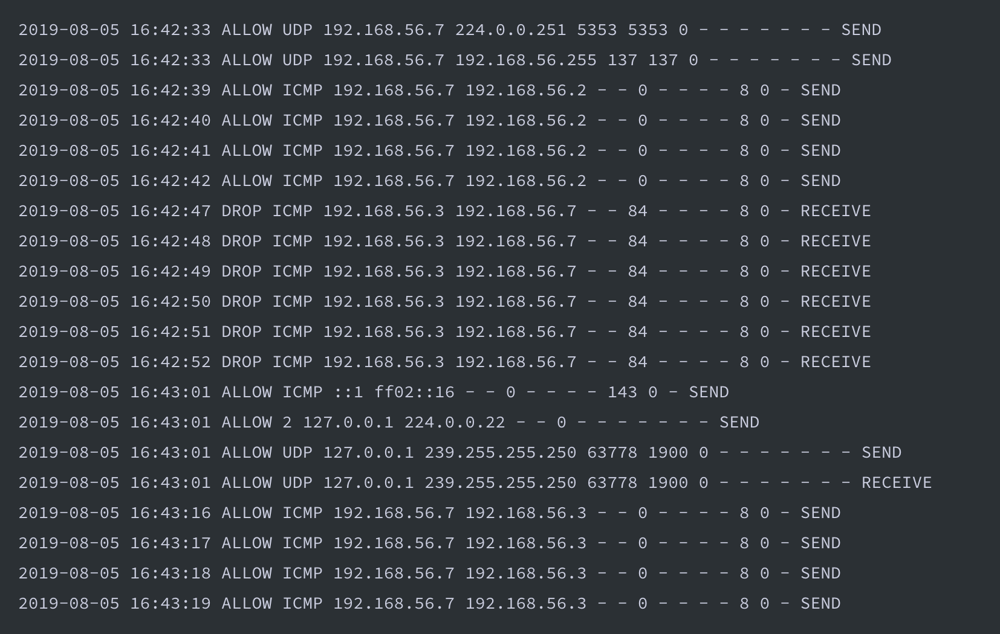
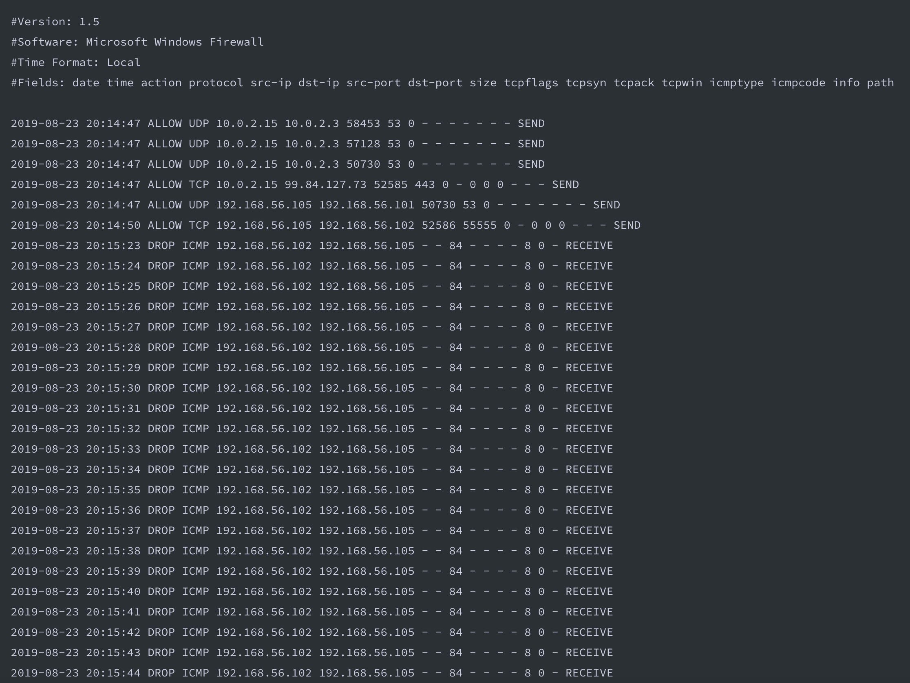
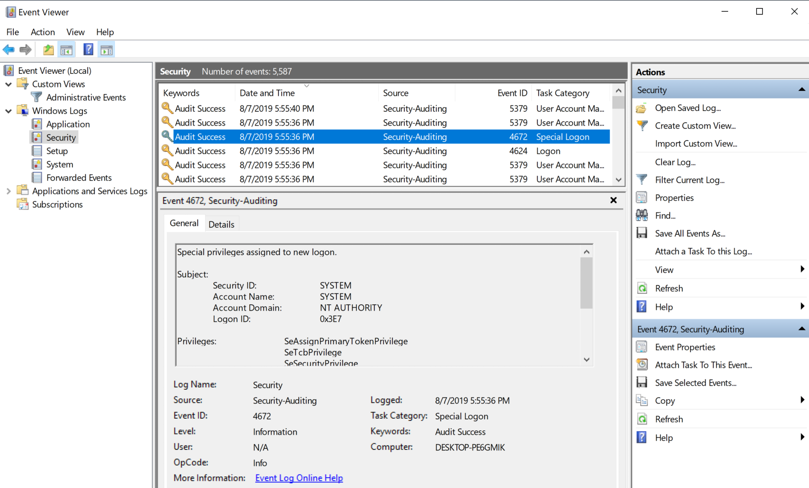
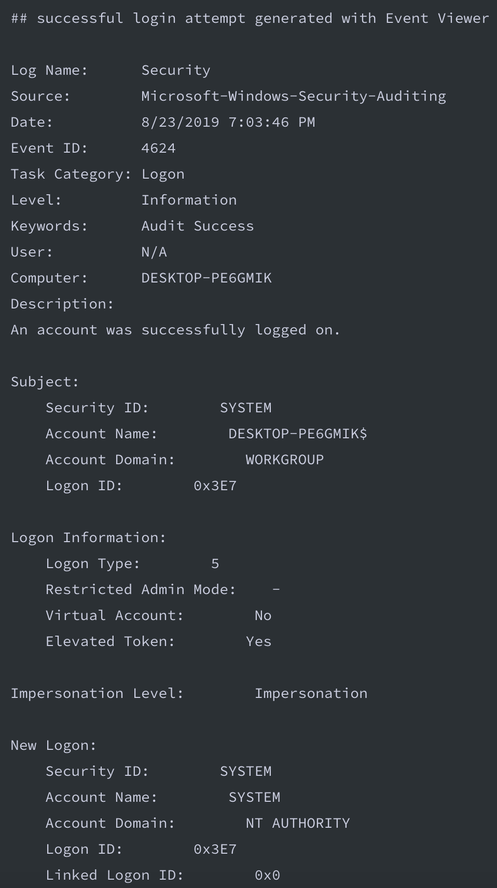

# Lab 8.28.19

## Logs
### Windows Logs
* Windows Log 1:

1. What application, service or type of defense might have generated these logs?
    * This log was generated by a firewall.
    * Format for log reading:
    ``` 
    <date> <time> <allow/deny> <protocol> <src ip> <dst ip> <src port> <dst port> <size> 
    <tcpflags> <tcpsyn> <tcpack> <tcpwin> <icmptype> <icmpcode> <info> 
    <path/direction of communication> 
    ``` 

* Windows Log 2:

2. What does the log show?
    * This log was generated by a firewall.
    * By default Windows firewalls block incoming pings, you can see this when 192.168.56.102 is pinging machine 192.168.56.105 - identify this by where it says "DROP" you look at the pattern: ICMP/second from 102 to 105.
    * Most likely using Splunk on port 55555.
    * Allows all outgoing communication from 105.

* Windows Log 3: Windows Event Viewer

2. This above photo shows a windows 10 Event Viewer logging activity executed with admin priv.

