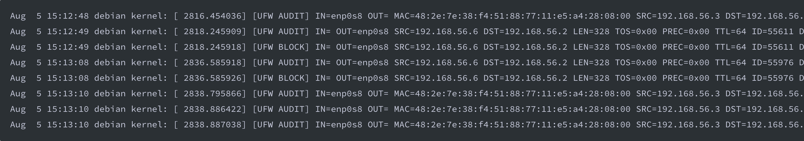
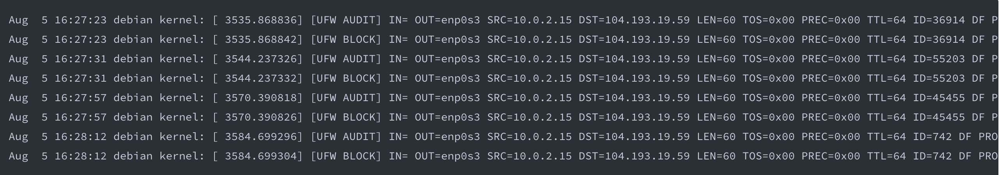
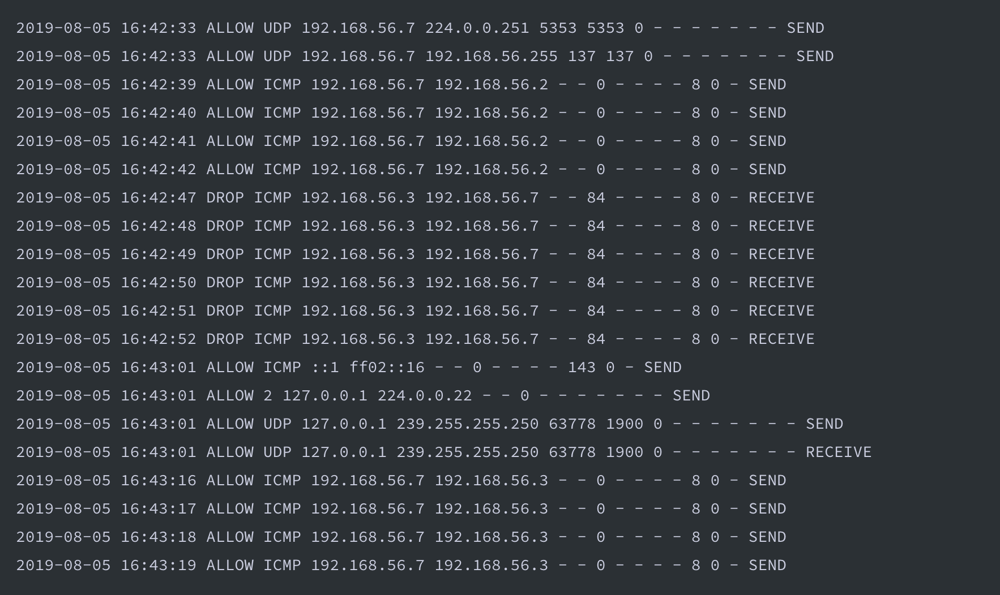

# <u> Network/Host Logs </u>

1. Identify the OS and network device that generated the following logs.
2. What is each log saying?
3. Which logs are normal vs malicious?

## Log 1

1. This log is Linux Debian and was generated by a firewall.
    * you can tell it is from a firewall because of the [ufw audit] [ufw block]
2. It shows TCP/UDP protocols going in and out.
3. This log appears normal 

## Log 2

1. This log is Linux Debian and was generated by a firewall.
    * you can tell from the [ufw audit] [ufw block]
2. This shows outbound traffic from one subnet to another where every other packet is blocked.
3. This log appears to be malicious because of the port being used (1337).
    * this port is known to be used by hackers

## Log 3

1. This log is a firewall