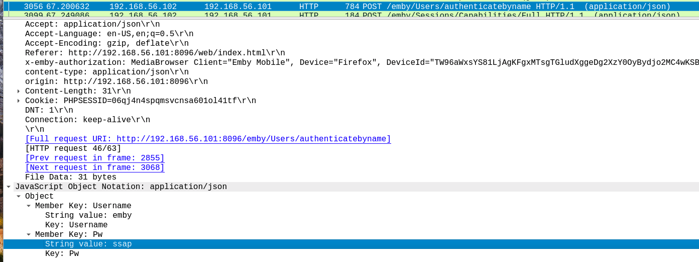

# Service Issue Plan
* Write a service issue response plan.
* Write an identification and response plan for services that an organization you're familiar with relies on. Your response plan should presume that a servive has been reported, but the cause isn't known. Ensure that you cover key elements discussed in this chapter, including:
  * How you would identify potential issues using the application and system logs
  * How you would monitor the service for problems
  * What types of issues you would look for
  * What the organization's response should be
* Once you have completed your plan, walk through it using an example issue. Ensure that your plan would address the issue and that you would be able to provide a complete report to your organization's management about the issue.

### How you would identify potential issues using the application and system logs
* We need to figure out the scope of our problems:
  * what did they do - what did they attack
  * what systems/servers/machines were affected by the outage

### How you would monitor the service for problems
* Review the logs for what we found to be in our scope:
  * network logs
  * system logs 
  * server logs 
  * antivirus logs 
* Capture data after identifying an issue:
  * Wireshark
  * SIEM
  * Splunk
  * Snort
  * tcpdump

### What types of issues you would look for
* Outdated software 
* Requests in logs from unknown sources 
* Network outages 
* Unauthorized access to materials 
* Any other informatio that would be in violation of the CIA triad

### What the organization's response should be
* Dependent upon the issues will specify who needs to be involved in the response team:
  * Executives, vital IT/security team, PR team, legal team, any third parties that are necessary (law enforcement)

---------------------------------------------------------

# Malicious or Not

## Passwords
* Suspected passwords sent via plaintext!
* Review the following pcap. Our systems have alerted that it may contain user credentials sent in the clear. Document what steps you take to find any evidence, such that your teammates might be able to verify your conclusions. Include references to specific packets/streams, and/or screenshotsas evidence. Complete the following tasks:
  * Find all instances of user passwords, or note that this is a false positive if none exist
  * Make recommendations for follow-up actions
    * Dismiss as false positive
    * More information required, what questions do you need to ask/answer
    * User action required, who do you contact and what do you say
    * Analyst/IT action, what action can remediate this incident?
    * Escalate to incident management, why does this require a larger response? Who might you need to include?

### Find all instances of user passwords, or note that this is a false positive if none exist
* These were the following passwords collected for evidence that were found to be in clear text:
  * ssap
  * cOljmJOm
  * password (appears twice but two different credentials)
  * tokyoneon:987654321

* The images below showcase each instance.

* Who is the source?
* What sites are they trying to access?
* Have other sites been accessed with these credentials?

---------------------------------------------------------
# Email
* User reports suspicious email, and sends you this screenshot.
* We love getting user reports! They are an important part of the defensive layers in our organization. Users frequently flag suspicious emails, but don't always send enough information to make a clear recommendation.
* Craft an email response to this user, thanking them for their report (you want more!) and asking for more information.
  * What specific information do you need? Include steps any user could follow to get that information to you.
* Send that email to your partner! Create a help ticket if you asked for information from the user
* Make recommendations for follow-up actions

### Email Draft
* Dear ____,
    
    Thank you for reporting this information to us. Can you please provide a few more details regarding this potential spam email?
    * Was this received to your work email?
    * Can you please forward the email in it's entirety to help@it.com
    * Is this the first time you are receiving this email?
    * Did you click any links from the email? If so, which link?
      * Did you enter any information on this link?
    * Are you aware of anyone else on your team receiving this same email?

Thank you in advance,

IT Team

